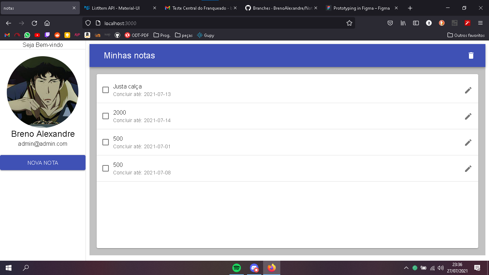
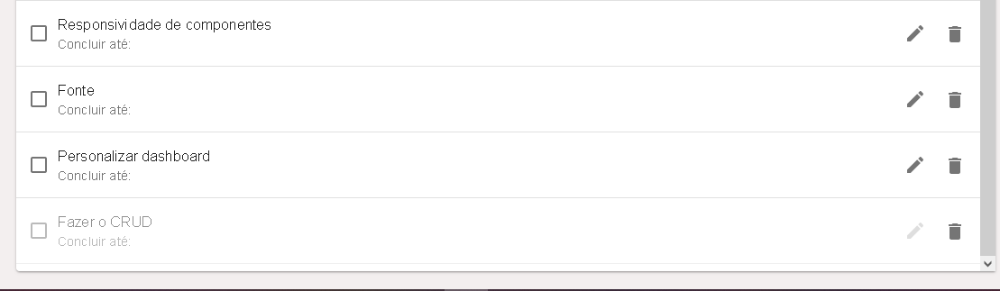

# MyNotes

### Tecnologias utilizadas:
* ReactJS
* MeteorJS
* MongoDB

### Funcionalidades:
* O app MyNotes é um app de tarefas com um sistema crud simples para inserção, edição e remoção de tarefas.

### Estilização:
* Foram usadas as bibliotecas Material-UI e Styled-Components para criar uma interface elegante e reponsiva.

### Imagens:
Essas sãos as poucas imagens que consegui recuperar do aplicatico em execução.

 
1 - É possível adicionar tarefas a partir e uma modal, edita-las e apaga-las em massa.

 

2- Aqui vemos uma tarefa marcada como concluida e a opção de apagar tarefas individuais.

